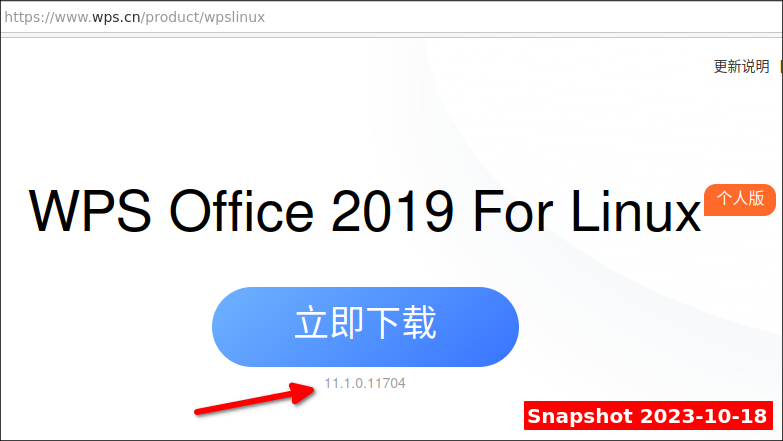
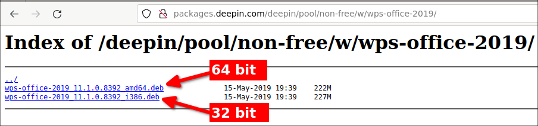

# wps-office-all-mui-win-language


# This working in WPS Office 2019 Linux version 11.1.0.11704 Update 2023

Tested in:

- Linux Mint 21 Vanessa ([base Ubuntu 22.04 Jammy](https://www.linuxmint.com/mirrors.php)) 

You must download the Chinese version because it has the language switcher button enabled:


**DOWNLOAD FROM**   

https://www.wps.cn/product/wpslinux  



**Deb de 64 bits**  

Version 11.1.0.11704 China 2023.08.18 (413 MB)  

For X64 (e.g. Ubuntu, Linux Mint, MX Linux, etc, etc)  
https://wps-linux-personal.wpscdn.cn/wps/download/ep/Linux2019/11704/wps-office_11.1.0.11704_amd64.deb

For MIPS  
https://wps-linux-personal.wpscdn.cn/wps/download/ep/Linux2019/11704/wps-office_11.1.0.11704_mips64el.deb

For ARM  
https://wps-linux-personal.wpscdn.cn/wps/download/ep/Linux2019/11704/wps-office_11.1.0.11704_arm64.deb

For LoongArch  
https://wps-linux-personal.wpscdn.cn/wps/download/ep/Linux2019/11704/wps-office_11.1.0.11704_loongarch64.deb

**Rpm de 64 bits**  

Version 11.1.0.11704 China 2023.08.18 (413 MB)  

For X64 (e.g. ArchLinux, Suse, Red Hat, etc, etc)  
https://wps-linux-personal.wpscdn.cn/wps/download/ep/Linux2019/11704/wps-office-11.1.0.11704-1.x86_64.rpm

For MIPS  
https://wps-linux-personal.wpscdn.cn/wps/download/ep/Linux2019/11704/wps-office-11.1.0.11704-1.mips64el.rpm

For ARM  
https://wps-linux-personal.wpscdn.cn/wps/download/ep/Linux2019/11704/wps-office-11.1.0.11704-1.aarch64.rpm

 

Or from next mirrors:


**Ubuntukylin Archive**  

https://archive.ubuntukylin.com/ubuntukylin/pool/partner/wps-office_11.1.0.11704_amd64.deb


**MEGA**  
The following link is a mirror that I have uploaded in case the other downloads fail:

https://mega.nz/folder/s6AQHSzC#Kd8qbA-Z7yeTa2P5qcVG3w

 

**Telegram (413 MB)**  

https://t.me/c/1343202595/14


# ttf-wps-fonts

These are the symbol fonts required by wps-office. They are used to display math formulas. 

Download

**For debian based Linux:**

https://github.com/wachin/ttf-wps-fonts/releases/download/1.0/ttf-wps-fonts_1.0_all.deb


**For rpm**

https://github.com/wachin/ttf-wps-fonts/releases/download/1.0/ttf-wps-fonts-1.0_all.rpm


**For others Linux**

https://github.com/wachin/ttf-wps-fonts/releases/download/1.0/ttf-wps-fonts_1.0.tar.gz

download the tar.gz file and extract it with right clic "Extract here", then copy the folder to:  

.fonts  

If this folder does not exist create it. To see hit Ctrl + H to show hidden directories.

# Chinese fonts

To work fine this WPS Office Chinese version neet the following fonts:  

batang.ttc
gulim.ttc
simfang.ttf
simhei.ttf
simkai.ttf
simsun.ttc
simsunb.ttf

Download it from:  

https://github.com/wachin/wps-office-all-mui-win-language/releases/download/v11.1.0.11704/wps-office-cn-fonts.7z  

download the .7z file and extract it with right clic "Extract here", then copy the folder to:  

.fonts  

If this folder does not exist create it. To see hit Ctrl + H to show hidden directories.

# Install ibus  

This is necessary for special characters like accent marks on Spanish language to can be written in this version 11.1.0.11704, If you need, install with:

	sudo apt install ibus ibus-gtk ibus-gtk3 ibus-gtk4 

after installed:

**RESTART YOUR COMPUTER**

**Note**: If you don't start it it doesn't work.


# Install MUI
MUI (Multilingual User Interface) for WPS Office Linux version 2019

Download from:

https://github.com/wachin/wps-office-all-mui-win-language/releases/download/v11.1.0.11704/mui.7z

and paste to:

.local/share/Kingsoft/office6

This folder is hidden (hit "Ctrl + H" to see) and appear from the first time when you open WPS Office Linux, If you have just installed it and have not opened it, open and close it, then the hidden folder appear

then extract there with right clic

This MUI contains:

```bat
    Chinese (China)
    English (USA)
    English (United Kingdom)
    French
    French (Canada)
    German (Germany)
    Indonesian
    Japanese (Japan)
    Polish (Poland)
    Portuguese (Brazil)
    Portuguese (Portugal)
    Russian (Russian Federation)
    Spanish (Mexico)
    Spanish (Spain)
```
<br />

to see the button to switch language, when you open WPS Office give clic in:

**New tab**


then create a new empty document: Presentation, Excel or Document:


the first time when you open the language switcher there is only two available:


# Install spell checking dictionaries

Download from:

https://github.com/wachin/wps-office-all-mui-win-language/releases/download/v11.1.0.11704/dicts.7z

and paste to:

.local/share/Kingsoft/office6

This folder is hidden (hit "Ctrl + H" to see) and appear from the first time when you open WPS Office Linux, If you have just installed it and have not opened it, open and close it, then the hidden folder appear

then extract there with right clic

This dicts contains:

```bat
af_ZA    African (South Africa)
be_BY    Belarusian (Belarus)
bg_BG    Bulgarian (Bulgaria)
bn_BD    Bengali (Bangladesh)
bs_BA    Bosnian (Bosnia and Herzegovina)
ca_ES    Catalan (Catalonia)
cs_CZ    Czech (Czech)
da_DK    Danish (Denmark)
de_DE    German (Germany)
el_GR    Greek (Greece)
en_AU    English (Australia)
en_GB    English (United Kingdom)
en_US    English (United States)
es_AR    Spanish (Argentina)
es_BO    Spanish (Bolivia)
es_CL    Spanish (Chile)
es_CO    Spanish (Colombia)
es_ES    Spanish (Spain)
es_MX    Spanish (Mexico)
es_PR    Spanish (Puerto Rico)
fr_FR    French (France)
gd_GB    Scots Gaelic (Great Britain)
gl       Galician (strict Volga)
gu_IN    Gujarati (India)
hi_IN    Hindi (India)
hr_HR    Croatian (Croatia)
hu_HU    Hungarian (Hungary)
id_ID    Indonesian
is       Icelandic
it_IT    Italian (Italy)
km_KH    Khmer (Cambodia)
lt_LT    Lithuanian (Lithuania)
ms_MY    Malay (Malaysia)
nb_NO    Norwegian (Norway)
ne_NP    Nepali (Nepal)
nl_NL    Dutch
pl_PL    Polish
pt_BR    Portuguese (Brazil)
pt_PT    Portuguese
qu_EC    Kichwa (Ecuador)
ro_RO    Romanian (Romania)
ru_RU    Russian (Russia)
sk_SK    Slovak (Slovakia)
sl_SI    Slovenian (Slovenia)
sq_AL    Albanian (Albania)
sr       Serbio
sv_SE    Swedish (Sweden)
sw_TZ    Swahili (Tanzania)
tr_TR    Turkish (Turkey)
uk_UA    Ukrainian (Ukraine)
vi_VN    Vietnamese (Vietnam)
```

<br />


# To install the Fix language selector

The program has a file with incomplete code:  

/opt/kingsoft/wps-office/office6/mui/lang_list/lang_list_community.json  

To fix it, firt create a backup of that file with:


```
sudo cp /opt/kingsoft/wps-office/office6/mui/lang_list/lang_list_community.json /opt/kingsoft/wps-office/office6/mui/lang_list/lang_list_community.json.backup
```
then replace the file with the one with the complete code:

```
wget -c https://github.com/wachin/wps-office-all-mui-win-language/releases/download/v11.1.0.11704/lang_list_community.json && sudo cp lang_list_community.json /opt/kingsoft/wps-office/office6/mui/lang_list/
```

restart WPS Office, repeat the steps, then working:


# Working in WPS Office 2019 Linux version 11.1.0.8392

all this files working in WPS Office 2019 Linux version 11.1.0.8392, you can download it from:

**Descarga MEGA:**


**WPS Office 64** y **32** bit + **ttf-wps-fonts**
https://mega.nz/folder/WhdGUCbD#AScUhE8HB_GI457CW2n3FQ

 

**Download from Telegram:**

64 bits
**https://t.me/PFSLE/10**

32 bits
**https://t.me/PFSLE/11**

ttf-wps-fonts
**https://t.me/PFSLE/13**

**Note:** You need extract the content with right clic extract here

 

**Download from packages.deepin.com**

http://packages.deepin.com/deepin/pool/non-free/w/wps-office-2019/




And working:


God Bless You

