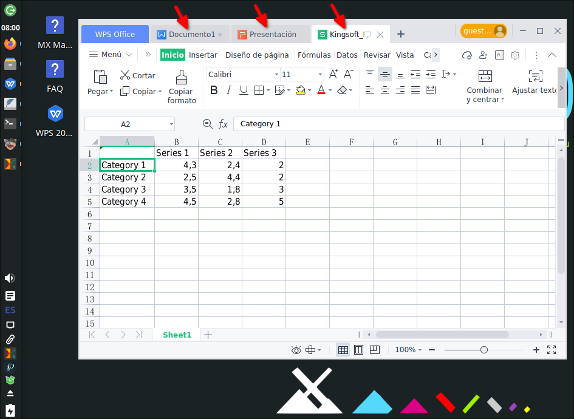
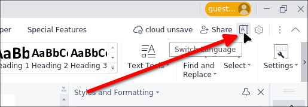
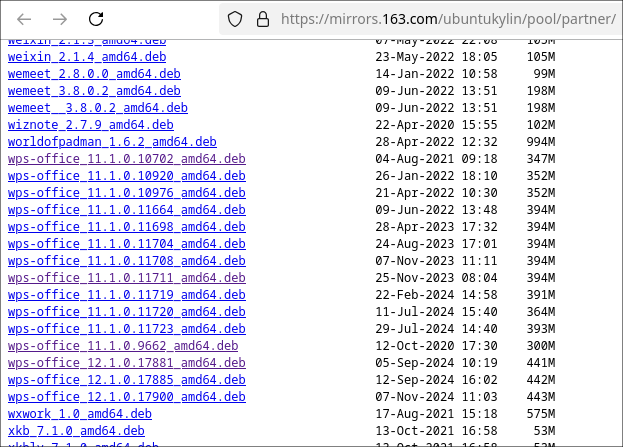
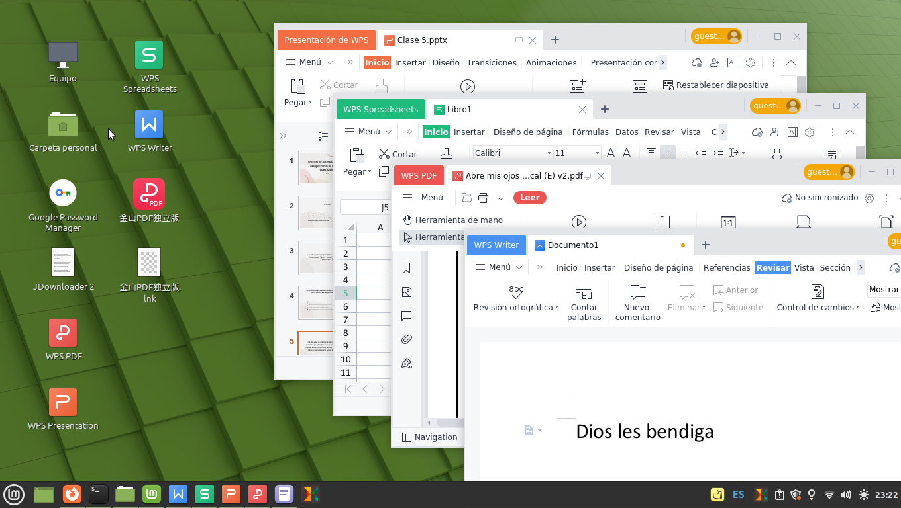
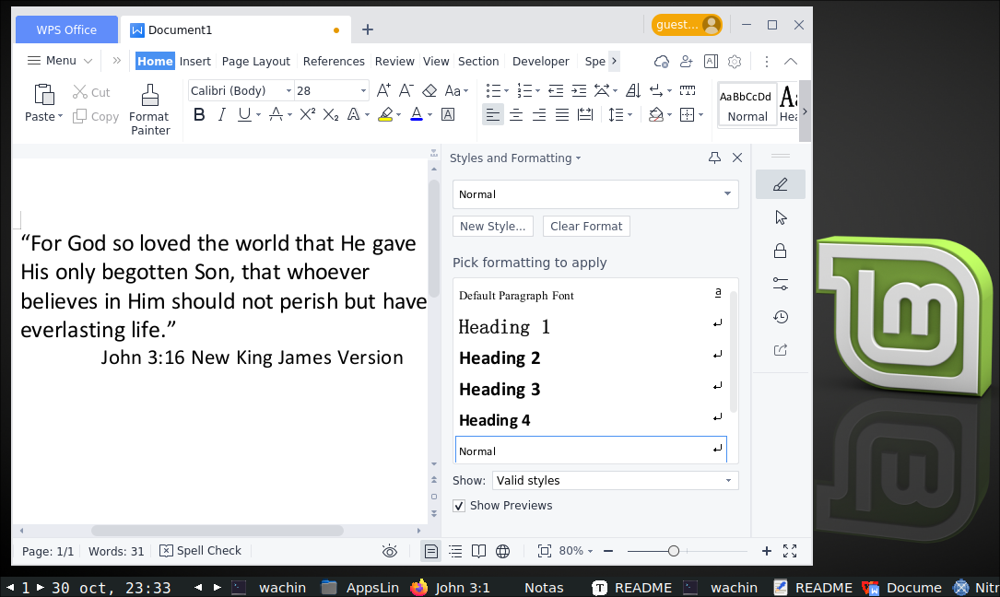
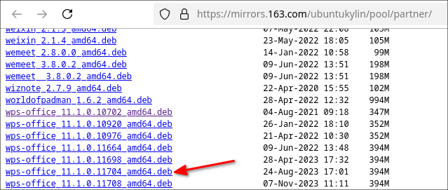
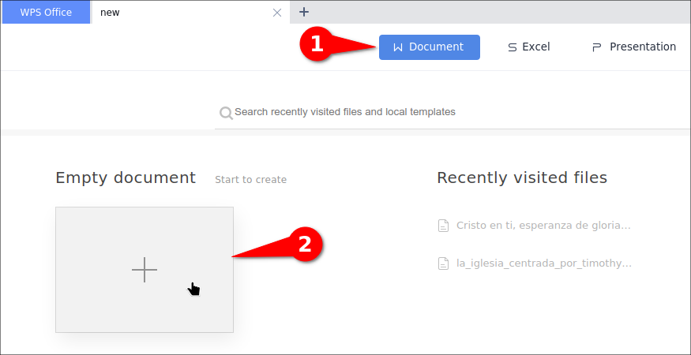
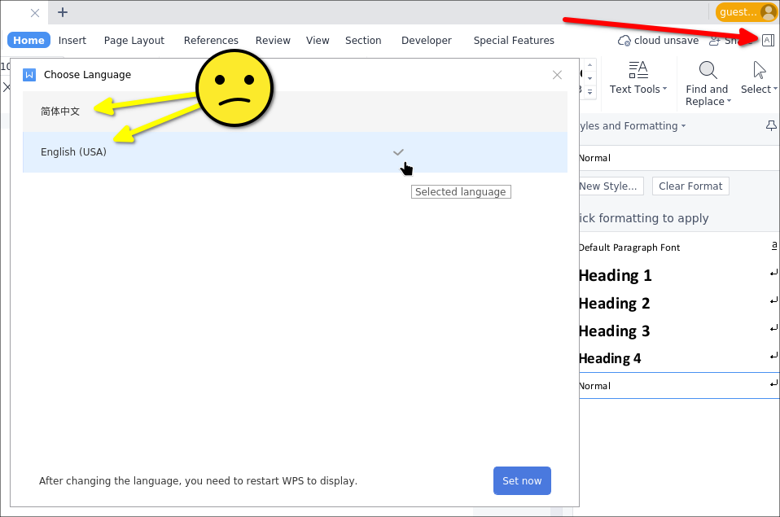

# wps-office-all-mui-win-language

En 2023, la empresa china de software Kingsoft Office, desarrolladora de WPS Office, lanzó una actualización con muchas mejoras para Linux disponible para computadoras de 64 bits. Estos son los pasos para que puedas instalarlo. Puedes hacerme cualquier pregunta por correo electrónico: wachin.id@gmail.com.

## Tutorial en español

Este tutorial está disponible en español aquí:

**WPS Office 2019 versión 11.1.0.11711 actualización 2023 para Linux**  
[https://facilitarelsoftwarelibre.blogspot.com/2023/11/wps-office-2019-version-11.1.0.11704-actualizacion-2023.html.html](https://facilitarelsoftwarelibre.blogspot.com/2023/11/wps-office-2019-version-11.1.0.11704-actualizacion-2023.html.html)

---

# Cómo instalar WPS Office versión 11.1.0.xxxxx en Linux (64 bits)

Este es un tutorial para instalar la versión 11.1.0.xxxxx en Linux, solo en sistemas de 64 bits.

## WPS Office 11.1.0.xxxxx probado en las siguientes distribuciones Linux

Probado en:

**Abreviaciones:**  
MX = MX Linux  
Deb = Debian  
Mint 21 = Linux Mint 21 Vanessa  
✔ = Funciona correctamente  
❌ = No funciona  

| Versión WPS  | Lanzamiento | MX 23 (Deb 12) | MX 21 (Deb 11) | Mint 21 | Ubuntu |
| ------------ | ---------- | -------------- | -------------- | ------- | ------ |
| 11.1.0.10702 | ?          | ❌             |                |         |        |
| 11.1.0.11704 | ©2023      | ✔              |                | ✔       |        |
| 11.1.0.11711 | ©2023      | ✔              | ✔              | ✔       |        |
| 11.1.0.11723 | ©2024      | ✔              |                |         |        |

---


WPS Office 11.1.0.xxxxx incluye cuatro programas:

- **Writer** (Procesador de textos)  
- **Presentation** (Presentaciones)  
- **Spreadsheet** (Hojas de cálculo)  
- **PDF**  

En la versión 11.1.0.11711, WPS Office tiene todos los programas en la misma ventana:



---

## La versión china de WPS Office tiene un botón de selección de idioma  

Debes descargar la versión china 11.1.0.xxxxx, ya que tiene habilitado el botón para cambiar el idioma:



---

## No uses la versión 12.1.0.xxxxx de WPS Office  

WPS Office Linux 12.1.0.xxxxx tiene problemas con el botón de cambio de idioma, ya que no está disponible. No la descargues desde:

[https://www.wps.cn/product/wpslinux](https://www.wps.cn/product/wpslinux)

Hasta enero de 2025, el botón de cambio de idioma no funciona en la versión 12.1:

- **wps-office_12.1.0.17881_amd64.deb**  
- **wps-office_12.1.0.17900_amd64.deb**  

Tal vez en el futuro lo arreglen.

**Nota:** El programa estaba disponible en [www.wps.cn](www.wps.cn), pero ya no se encuentra allí.

---

## Descargar desde una web espejo  

Algunas versiones de WPS están disponibles en la siguiente web espejo, pero no sé cuándo el enlace dejará de funcionar:

[https://mirrors.163.com/ubuntukylin/pool/partner/](https://mirrors.163.com/ubuntukylin/pool/partner/)  



Además, si deseas usar la versión 11.1.0.11704 de WPS Office Linux, que tiene cada programa por separado, como se muestra en la siguiente imagen:



Aquí tienes otra captura:



Puedes descargarla aquí:



---

## Descarga desde MEGA  

El siguiente enlace es un espejo que he subido a mi cuenta de **MEGA** en caso de que los otros enlaces fallen. Contiene varias versiones:

🔗 [https://mega.nz/folder/s6AQHSzC#Kd8qbA-Z7yeTa2P5qcVG3w](https://mega.nz/folder/s6AQHSzC#Kd8qbA-Z7yeTa2P5qcVG3w)  

---

## Descarga desde Telegram  

En **Telegram**, tengo algunas versiones disponibles:  

📥 [https://t.me/c/1343202595/14](https://t.me/c/1343202595/14)  

---

## Sobre la advertencia: "Este tipo de archivo puede dañar tu computadora. ¿Deseas descargar el archivo .deb de todos modos?"  

Ese mensaje es una advertencia general que aparece al descargar archivos ejecutables, como los archivos **.deb** en sistemas Linux. Los archivos **.deb** contienen paquetes instalables y, si provienen de fuentes no confiables, podrían contener software malicioso que podría dañar tu sistema o comprometer su seguridad.  

La advertencia **no** significa necesariamente que el archivo sea peligroso, sino que debes tener precaución y asegurarte de que proviene de una fuente confiable. Es importante verificar la autenticidad y el origen del archivo antes de instalarlo, especialmente si **no lo descargas desde los repositorios oficiales de tu distribución Linux**.  

También puedes analizarlo en **VirusTotal** para comprobar su seguridad:  

🔍 [https://virustotal.com](https://virustotal.com)  

---

## 1.) Instalar un archivo .deb con clic derecho  

Cuando haces clic derecho sobre el archivo **.deb**, debería aparecer una opción en el explorador de archivos para instalarlo. Esto sucede en **MX Linux, Debian y Ubuntu**. Si en tu distribución no aparece esta opción, busca en internet cómo instalar archivos **.deb** manualmente.

---


## 3.) Instalar fuentes chinas  

Para que la versión china de **WPS Office** funcione correctamente, se necesitan las siguientes fuentes:  

- **batang.ttc**  
- **gulim.ttc**  
- **simfang.ttf**  
- **simhei.ttf**  
- **simkai.ttf**  
- **simsun.ttc**  
- **simsunb.ttf**  

Puedes descargarlas desde el siguiente enlace:  

🔗 [https://github.com/wachin/wps-office-all-mui-win-language/releases/download/v11.1.0.11704/wps-office-cn-fonts.7z](https://github.com/wachin/wps-office-all-mui-win-language/releases/download/v11.1.0.11704/wps-office-cn-fonts.7z)  

Después de descargar el archivo **.7z**, extrae su contenido haciendo **clic derecho → "Extraer aquí"** y copia la carpeta en:  

📂 **~/.fonts**  

Si esta carpeta no existe, créala manualmente. Para verla, presiona **Ctrl + H** para mostrar directorios ocultos.  

---

## 4.) Instalar **ibus**  

Este paquete es necesario para poder escribir caracteres especiales, como las tildes en español. Para instalarlo, usa el siguiente comando en la terminal:  

```bash
sudo apt install im-config ibus ibus-gtk ibus-gtk3
```

En algunas distribuciones de Linux más modernas, puede ser necesario instalar el siguiente paquete adicional:  

```bash
sudo apt install ibus-gtk4
```

📌 **Después de la instalación, reinicia tu computadora** para que los cambios surtan efecto.  
⚠️ **Nota:** Si no reinicias el sistema, **ibus** no funcionará correctamente.  

---

## 5.) Instalar MUI (Interfaz de Usuario Multilingüe)  

El **MUI (Multilingual User Interface)** permite cambiar el idioma de **WPS Office Linux 2019**.  

🔗 **Descargar desde GitHub:**  
[https://github.com/wachin/wps-office-all-mui-win-language/releases/download/v11.1.0.11704/mui.7z](https://github.com/wachin/wps-office-all-mui-win-language/releases/download/v11.1.0.11704/mui.7z)  

Después de descargar el archivo **.7z**, descomprímelo y cópialo en la siguiente ubicación:  

📂 **~/.local/share/Kingsoft/office6**  

Esta carpeta está oculta. Para mostrarla, presiona **Ctrl + H** en tu explorador de archivos.  

⚠️ **Importante:** La carpeta **Kingsoft/office6** solo aparecerá después de haber abierto **WPS Office** por primera vez. Si acabas de instalarlo y no ves la carpeta, **abre y cierra el programa** para que se genere automáticamente.  

📌 **Idiomas incluidos en el MUI:**  

```bash
- Chino (China)  
- Inglés (EE. UU.)  
- Inglés (Reino Unido)  
- Francés  
- Francés (Canadá)  
- Alemán (Alemania)  
- Indonesio  
- Japonés (Japón)  
- Polaco (Polonia)  
- Portugués (Brasil)  
- Portugués (Portugal)  
- Ruso (Federación Rusa)  
- Español (México)  
- Español (España)  
```

Para cambiar el idioma de WPS Office:  

1. **Abre WPS Office**  
2. Haz clic en **"Nueva pestaña"**  
   
     

3. Crea un documento nuevo (Presentación, Excel o Documento)  

     

4. La primera vez que abras el selector de idioma, solo habrá dos opciones disponibles:  

     

---


## 2.) Instalar las fuentes ttf-wps-fonts  

Estas son fuentes de símbolos necesarias para **WPS Office**. Se utilizan para mostrar fórmulas matemáticas. Como la descarga oficial ya no está disponible, he subido el archivo a **GitHub**:

🔹 **Para Linux basado en Debian:**  
[https://github.com/wachin/ttf-wps-fonts/releases/download/1.0/ttf-wps-fonts_1.0_all.deb](https://github.com/wachin/ttf-wps-fonts/releases/download/1.0/ttf-wps-fonts_1.0_all.deb)  

🔹 **Para Linux basado en RPM:**  
[https://github.com/wachin/ttf-wps-fonts/releases/download/1.0/ttf-wps-fonts-1.0_all.rpm](https://github.com/wachin/ttf-wps-fonts/releases/download/1.0/ttf-wps-fonts-1.0_all.rpm)  

🔹 **Para otras distribuciones Linux:**  
[https://github.com/wachin/ttf-wps-fonts/releases/download/1.0/ttf-wps-fonts_1.0.tar.gz](https://github.com/wachin/ttf-wps-fonts/releases/download/1.0/ttf-wps-fonts_1.0.tar.gz)  

Después de descargar el archivo **.tar.gz**, extrae su contenido haciendo clic derecho en **"Extraer aquí"** y luego copia la carpeta en:

📂 **~/.fonts**  

Si esta carpeta no existe, créala manualmente. Para verla, presiona **Ctrl + H** para mostrar directorios ocultos.

---


---

## 6.) Instalar la corrección del selector de idioma  

El programa contiene un archivo con código incompleto ubicado en:  

📂 **/opt/kingsoft/wps-office/office6/mui/lang_list/lang_list_community.json**  

Para corregirlo, primero haz una copia de seguridad del archivo original con el siguiente comando en la terminal:  

```bash
sudo cp /opt/kingsoft/wps-office/office6/mui/lang_list/lang_list_community.json /opt/kingsoft/wps-office/office6/mui/lang_list/lang_list_community.json.backup
```

Luego, reemplázalo por la versión corregida con este comando:  

```bash
wget -c https://github.com/wachin/wps-office-all-mui-win-language/releases/download/v11.1.0.11704/lang_list_community.json && sudo cp lang_list_community.json /opt/kingsoft/wps-office/office6/mui/lang_list/
```

📌 **¿Qué hace este comando?**  
1. Descarga el archivo corregido en tu carpeta **HOME**.  
2. Luego, te pedirá permisos de **superusuario** para copiarlo en la ubicación correcta dentro del sistema.  

Si deseas revisar su contenido antes de instalarlo, puedes abrir el archivo descargado con un editor de texto.  

Después de **reiniciar WPS Office** (no lo hagas aún hasta instalar los diccionarios), repite los pasos para abrir el selector de idioma. Ahora todas las opciones estarán disponibles:  

  

⚠️ **Nota:** Si actualizas WPS Office en el futuro, deberás aplicar nuevamente esta corrección.  

---

## 7.) Instalar los diccionarios de corrección ortográfica  

🔗 **Descargar desde GitHub:**  
[https://github.com/wachin/wps-office-all-mui-win-language/releases/download/v11.1.0.11704/dicts.7z](https://github.com/wachin/wps-office-all-mui-win-language/releases/download/v11.1.0.11704/dicts.7z)  

Después de descargar el archivo **.7z**, descomprímelo y cópialo en la siguiente ubicación:  

📂 **~/.local/share/Kingsoft/office6**  

⚠️ **Recuerda:** Esta carpeta está oculta y solo aparecerá después de abrir **WPS Office** por primera vez. Si no la ves, presiona **Ctrl + H** para mostrar archivos ocultos.  

📌 **Idiomas incluidos en los diccionarios de corrección ortográfica:**  

```bash
af_ZA    Afrikáans (Sudáfrica)  
be_BY    Bielorruso (Bielorrusia)  
bg_BG    Búlgaro (Bulgaria)  
bn_BD    Bengalí (Bangladesh)  
bs_BA    Bosnio (Bosnia y Herzegovina)  
ca_ES    Catalán (Cataluña)  
cs_CZ    Checo (República Checa)  
da_DK    Danés (Dinamarca)  
de_DE    Alemán (Alemania)  
el_GR    Griego (Grecia)  
en_AU    Inglés (Australia)  
en_GB    Inglés (Reino Unido)  
en_US    Inglés (Estados Unidos)  
es_AR    Español (Argentina)  
es_BO    Español (Bolivia)  
es_CL    Español (Chile)  
es_CO    Español (Colombia)  
es_ES    Español (España)  
es_MX    Español (México)  
es_PR    Español (Puerto Rico)  
fr_FR    Francés (Francia)  
gd_GB    Gaélico escocés (Gran Bretaña)  
gl       Gallego (Galicia)  
gu_IN    Guyaratí (India)  
hi_IN    Hindi (India)  
hr_HR    Croata (Croacia)  
hu_HU    Húngaro (Hungría)  
id_ID    Indonesio  
is       Islandés  
it_IT    Italiano (Italia)  
km_KH    Jemer (Camboya)  
lt_LT    Lituano (Lituania)  
ms_MY    Malayo (Malasia)  
nb_NO    Noruego (Noruega)  
ne_NP    Nepalí (Nepal)  
nl_NL    Holandés  
pl_PL    Polaco  
pt_BR    Portugués (Brasil)  
pt_PT    Portugués (Portugal)  
qu_EC    Kichwa (Ecuador)  
ro_RO    Rumano (Rumania)  
ru_RU    Ruso (Rusia)  
sk_SK    Eslovaco (Eslovaquia)  
sl_SI    Esloveno (Eslovenia)  
sq_AL    Albanés (Albania)  
sr       Serbio  
sv_SE    Sueco (Suecia)  
sw_TZ    Suajili (Tanzania)  
tr_TR    Turco (Turquía)  
uk_UA    Ucraniano (Ucrania)  
vi_VN    Vietnamita (Vietnam)  
```


---

## 8.) Corregir el error de WPS Office al guardar como PDF  

En algunas distribuciones de Linux, como:  

- **MX Linux 23 (basado en Debian 12)**  
- **Ubuntu 24.04**  

WPS Office puede fallar al guardar documentos en formato **PDF**. Para solucionarlo, sigue estos pasos:  

### 🔹 Paso 1: Verificar si tienes instalado el paquete `libtiff6`  

Ejecuta el siguiente comando en la terminal:  

```bash
dpkg -l | grep libtiff6
```

Si **no** aparece en la lista, instálalo con:  

```bash
sudo apt install libtiff6
```

### 🔹 Paso 2: Crear un enlace simbólico para simular la versión `libtiff5`  

Ejecuta el siguiente comando en la terminal:  

```bash
sudo ln -s /usr/lib/x86_64-linux-gnu/libtiff.so.6 /usr/lib/x86_64-linux-gnu/libtiff.so.5
```

📌 **¿Por qué es necesario este paso?**  
WPS Office busca la versión **libtiff5**, pero en las versiones más recientes de Linux, solo está disponible **libtiff6**. Este comando crea un **enlace simbólico** que hace que el sistema "engañe" a WPS Office y le permita usar la versión disponible.  

### 🔹 Paso 3: Reiniciar WPS Office  

Después de hacer estos cambios, **reinicia WPS Office** e intenta nuevamente guardar como PDF.  

---

## Origen de los diccionarios y archivos MUI  

Si te preguntas de dónde provienen los archivos de **diccionarios** y **MUI**, aquí tienes la explicación:  

🔗 **Ubicación de los archivos en PlayOnLinux:**  
[https://github.com/wachin/wps-office-all-mui-win-language/blob/master/src/PlayOnLinux's%20virtual%20drives/Where%20is%20the%20files%20under%20PlayOnLinux.md](https://github.com/wachin/wps-office-all-mui-win-language/blob/master/src/PlayOnLinux's%20virtual%20drives/Where%20is%20the%20files%20under%20PlayOnLinux.md)  

🔗 **Ubicación de los archivos en Windows 8.1:**  
[https://github.com/wachin/wps-office-all-mui-win-language/blob/master/src/C_Windows8.1/Where%20is%20the%20files%20on%20Windows%208.1.md](https://github.com/wachin/wps-office-all-mui-win-language/blob/master/src/C_Windows8.1/Where%20is%20the%20files%20on%20Windows%208.1.md)  

---

# Cómo instalar WPS Office 2019 Linux 11.1.0.8392 (32 y 64 bits)  

Esta versión puede dejar de funcionar en las versiones más recientes de Linux a partir de **2024**, pero fue probada y funcionó correctamente en:  

- **MX Linux 17** (basado en Debian 9 Stretch)  
- **MX Linux 19** (basado en Debian 10 Buster)  
- **MX Linux 21** (basado en Debian 11 Bullseye)  

📌 **Nota:** MX Linux está basado en Debian.  

Para conocer los ciclos de vida de Debian, revisa la siguiente página:  
🔗 [https://www.debian.org/releases/](https://www.debian.org/releases/)  

📌 **WPS Office 2019 Linux 11.1.0.8392 (64 bits) funciona bien en:**  
- **Ubuntu 18.04**  
- **Ubuntu 20.04**  

---

## Descargar WPS Office 2019 desde MEGA  

🔗 **WPS Office 64 y 32 bits + ttf-wps-fonts**  
[https://mega.nz/folder/WhdGUCbD#AScUhE8HB_GI457CW2n3FQ](https://mega.nz/folder/WhdGUCbD#AScUhE8HB_GI457CW2n3FQ)  

---

## Descargar WPS Office 2019 desde Telegram  

🔗 **Versión 64 bits**  
📥 [https://t.me/PFSLEE/10](https://t.me/PFSLEE/10)  

🔗 **Versión 32 bits**  
📥 [https://t.me/PFSLEE/11](https://t.me/PFSLEE/11)  

🔗 **ttf-wps-fonts**  
📥 [https://t.me/PFSLEE/13](https://t.me/PFSLEE/13)  

📌 **Nota:** Debes extraer el contenido con **clic derecho → "Extraer aquí"**.  

---

## Seguir solo los siguientes pasos para instalar WPS Office 2019 (11.1.0.8392)  

Si deseas instalar **WPS Office 11.1.0.8392** (32 o 64 bits) en Linux, sigue estos pasos:  

📌 **Compatible con:**  
- **MX Linux 19 y 21**  
- **Debian 10 y 11**  
- **Ubuntu 20.04**  

⚠️ **Es posible que esta versión no funcione en distribuciones más nuevas de Linux.**  

Para completar la instalación, sigue los mismos pasos mencionados anteriormente:  

```plaintext
## 2.) Instalar ttf-wps-fonts  
## 3.) Instalar fuentes chinas  
## 5.) Instalar MUI (Interfaz de usuario multilingüe)  
## 6.) Corregir el selector de idioma  
## 7.) Instalar diccionarios de corrección ortográfica  
```

---

## ¡Dios te bendiga!  

---

# Referencias  

🔹 **Configuración de ibus en Debian**  
[https://wiki.debian.org/I18n/ibus](https://wiki.debian.org/I18n/ibus)  

🔹 **Error al convertir documentos a PDF en WPS Office (Ubuntu)**  
[https://www.reddit.com/r/Ubuntu/comments/17ehukn/wps_converting_to_pdf_error/](https://www.reddit.com/r/Ubuntu/comments/17ehukn/wps_converting_to_pdf_error/)  

---
